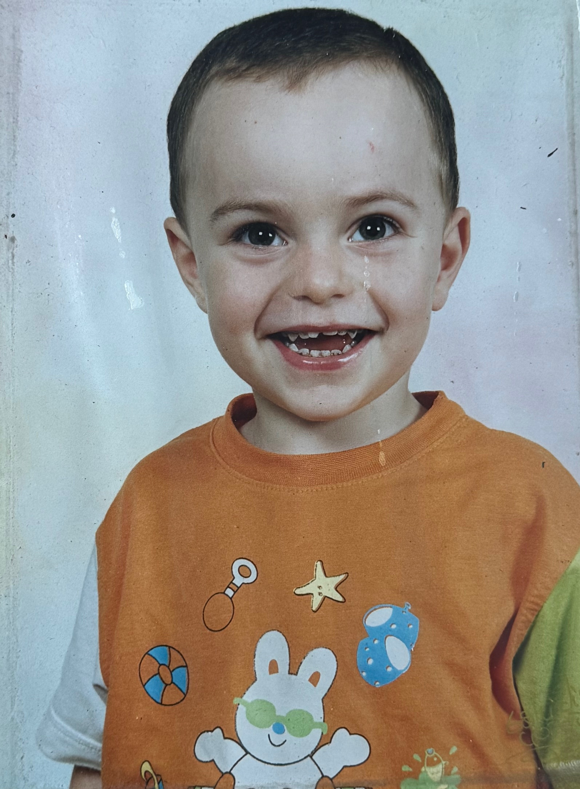
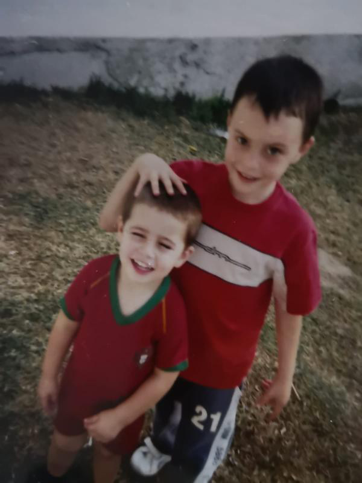
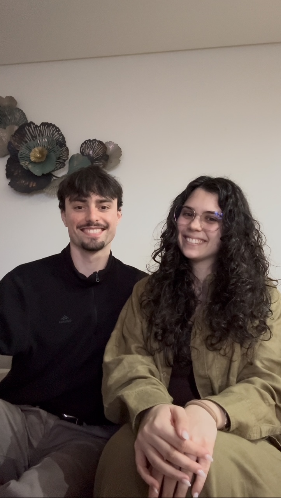

# Entrevista a João Pedro Silva

*Fotografias de João Pedro quando era pequeno em casa dele.*

## *1. Introdução*

<interviewer>Boa tarde, o meu nome é Beatriz Oliveira e gostaria de começar por agradecer a sua disponibilidade para esta entrevista. 
Pode começar por se apresentar, diga o seu nome e a sua idade. </interviewer>

<interviewee>Boa tarde, sou o João e tenho 22 anos. </interviewee>

<interviewer>Pronto, pode começar por falar um pouco sobre onde você nasceu e cresceu, por favor? </interviewer>

<interviewee>Eu nasci numa aldeia em Famalicão chamada Mogege, bastante pacata, que não tem nada, tipo, para aí uns três cafés, 
mas é bastante rodeado de natureza e um sítio tranquilo em geral, que eu diria que foi muito bom para a minha infância.

<interviewer>Como era a sua casa e o ambiente onde você viveu na sua infância?</interviewer> 
<interviewee>A minha casa era muito parecida à das outras pela zona, era uma casa mais ou menos grande, com algum terreno, mas que no entanto já era bastante antiga, então às vezes nos invernos era bastante fria, no verão era bastante quente, mas nada que não se aguentasse. O mais importante, eu diria, era até o facto de eu viver muito perto da minha família, eles viviam do outro lado da estrada, basicamente, então deu um ambiente muito bom para eu crescer, visto que eu estava constantemente com os meus familiares e podia ir para o grande terreno dos meus avós, que até tinha animais e tudo, que eu gostava muito. Foi engraçado.</interviewee>

## *2. Rotina e cotidiano* 

<interviewer>Isso é bastante interessante, por acaso. Então pode falar um bocado do que era um dia típico na sua infância, 
já que falou que vivia muito perto dos seus avós e primos?</interviewer>

<interviewee>Sim, era acordar, sempre arrogente e sonolento, lembro que a minha mãe às vezes até me tinha de vestir e tudo, 
porque eu não queria ir para a escola, depois era tomar o pequeno almoço, que era sempre o clássico, leite com cereais, ia fazer 
toda aquela rotina, lavar os dentes, lavar a cara, o que fosse, e depois ia para a escola.  A maior parte das vezes ia a pé com a 
minha tia e o meu primo, o que também era engraçado, e quando chegava lá, tinha as aulas que tinha a ter, tinha os intervalos que 
era a minha parte favorita, em que eu brincava, jogava futebol, esse tipo de coisas, depois quando chegava mais ou menos pelas cinco, 
cinco e um quarto, voltava de casa à pé, que a minha tia ia buscar a mim e ao meu primo, ficava a brincar no quintal dela, até os meus 
pais chegarem do trabalho, porque eles faziam horas extras na altura, depois ia para casa, jogava Playstation com o meu irmão, ou fazia 
os trabalhos de casa, o que fosse, e ia dormir e repetia no dia seguinte.</interviewee> 

<interviewer>Você referiu que jogava futebol, também jogava Playstation com o seu irmão, havia alguma brincadeira ou atividade que você gostava muito de fazer quando era mais novo? </interviewer> 
 
<interviewee>Eu gostava muito, e lembro-me bastante bem, de jogar futebol nos intervalos, que nós, que ela era uma escola pequena, então só tinha duas turmas no nosso ano, e nós fazíamos, tínhamos meio que uma rivalidade com a outra turma, então eu gostava muito de jogar futebol. Mas também tinha outras coisas, na parte da Playstation 2, também era incrível jogar com o meu irmão, adorava principalmente o jogo de WWE, porque era de andar à porrada, então era bastante engraçado, e sim, acho que é isso. Também acabei por ter uma coleção, na altura fazia coleção de cartas de Yu-Gi-Oh!, o que era muito bom, porque às vezes chovia, não dava para jogar à bola, então nós jogávamos Yu-Gi-Oh! uns com os outros. Sim.</interviewee>

<interviewer>Pronto, então agora parando um bocado de falar dos jogos, tenho aqui uma questão que também é um bocado interessante, um bocado 
única, lembra-se de algum cheiro, som ou sabor que o faz lembrar da sua infância? </interviewer> 

<interviewee>Principalmente o cheiro da manhã, no que toca ao cheiro eu acho que é isso, eu não consigo explicar-lhe exatamente, mas quando 
ia a pé para a escola, estava sempre com meio que um nevoeiro, um frio, mas aquilo tinha um cheiro particular, que eu me lembro até hoje. 
Sabores, não sei tanto, a não ser aquelas sopas que eles nos obrigavam a comer ao almoço, que eram intragáveis, não gostava nada daquilo, 
para ser honesto, mas tinha que ser, e lembro que nós até fazíamos um jogo, que era tapar o nariz e comer o mais rápido possível, e quem 
comesse aquilo o mais rápido possível ganhava. Sons, nunca me vou esquecer do som daquelas vozes estridentes de miúdos a gritar golo, 
sempre que se marcava um golo, talvez porque até hoje, como a casa da minha avó ainda é bastante perto da escola, às vezes ainda ouço 
os miúdos hoje em dia a gritar golo, e faz-me sempre recordar dessa época, o que até é bastante engraçado. </interviewee>

## *3. Escola e amigos*

<interviewer>Ok, então agora, sendo um bocado da área da família, vamos passar um bocado para a escola e os seus amigos. Como é que é a sua experiência, ou como foi a sua experiência na escola? Gostava de estudar ou não gostava? Diga a verdade. </interviewer>

<interviewee>A minha experiência na escola eu diria que foi bastante boa, como era uma escola nessa mesma aldeia, e era bastante 
pequena, as turmas conheciam-se todas, as pessoas conheciam-se todas, era um ambiente muito bom. Agora, gostar de estudar, na altura 
gostava, realmente, depois pronto, as coisas ficam diferentes, mas na altura lembro-me que gostava bastante, até lia bastante, e tudo, 
o que era surpreendente para uma criança daquela altura, mas sim, eu diria que sim, foi uma experiência de escola muito positiva.</interviewee> 

<interviewer>Pronto, então agora que falámos da escola, vamos passar aos seus amigos. Como é que eram os seus amigos de infância? 
Ainda têm contacto com alguns deles? </interviewer> 

<interviewee>Os meus amigos de infância também foram incríveis. Nós sempre fomos muito chegados, alguns de nós vinham já desde o infantário, 
e quando nós chegámos lá, à escola primária, éramos muito unidos, não sei, era uma espécie de dinâmica de grupo muito boa, como uma turma 
inteira. Então eu lembro-me muito bem deles, e lembro-me, tenho muitas recordações com eles. Claro que ao longo dos anos alguns foram saindo 
das turmas, por o quer que seja, e no décimo ano dividiu-se tudo, mas o percurso escolar foi quase tudo feito com essas mesmas pessoas, e eu gostei muito. Agora, se mantém um contacto? Sim, alguns deles mantêm um contacto, a maior parte deles eu vejo-os por aí e cumprimento, e acho que ainda existe uma relação de amizade, mas o mais importante é mesmo um específico, que até hoje eu faço tudo com ele. Até posso dizer que até hoje ele é o meu melhor amigo.</interviewee> 

<interviewer>Ok, muito interessante essa história, e agora que falámos da escola, falámos dos amigos, mas não podemos falar da escola sem não abordar o tema dos professores. Tinha algum professor ou professora que marcou a sua vida de maneira positiva ou negativa?</interviewer>

<interviewee>Como era uma escola muito pequena, nós tivemos... eu tive a mesma professora do primeiro ao quarto ano, e essa professora foi 
talvez uma das pessoas mais importantes, e que eu me lembro mais da minha infância, porque realmente ela tratava-nos quase como filhos. 
Nós éramos a única turma dela, estávamos constantemente com ela, e era incrível a atenção e o quanto ela se importava connosco. 
Apesar de ela já ter alguma idade na altura e, pronto, ainda ter alguns hábitos de reguada, no sentido em que gostava de uma disciplina mais 
severa, mesmo assim tratava-nos bem. Para não falar que para mim em específico, ela acabou por ser a pessoa que suscitou o meu amor pela leitura 
e pela escrita, principalmente a escrita, porque ela dizia que eu tinha bastante jeito e até houve certas ocasiões em que ela pegava nas minhas 
composições e mandava para o agrupamento de escolas da altura, que até ficava naqueles quadros engraçados de cortiça. </interviewee>

## *4. Família e tradições*

*João Pedro com o seu primo na casa dos seus avós.*

<interviewer>Gostei bastante e ouvi falar da escola e acho que seria importante voltarmos ao tema da família e das tradições. Será que me 
pode falar como é que era a sua relação com os seus pais e irmão? </interviewer>

<interviewee> Sim, sinto que foi bastante sortudo nisso da família.  A família não é algo que nós escolhemos e eu, por acaso, tive uma 
lotaria bastante boa. Bastante sorte. Os meus pais sempre foram bastante compreensivos e gentis, sempre envolvidos na minha vida, sempre 
disponíveis para o que quer que fosse, sempre estiveram lá e nunca me trataram mal em nenhuma ocasião. O que eu posso dizer que estou bastante 
feliz por ter tido os pais que tenho. O meu irmão mais velho também é nessa onda. Nós sempre tivemos uma relação incrível. Ele sempre foi aquela 
figura de irmão mais velho que estava sempre lá e ele acabou também por ser o meu ídolo na infância, para ser honesto, e ensinou-me bastantes 
coisas. Se hoje eu gosto de tecnologia, de jogos, de história, era porque nós realmente passávamos muito tempo um com o outro. Lembro-me que 
nós adorávamos ver o canal Histórias juntos e de jogar jogos juntos, como eu disse anteriormente, aquele da Playstation 2. Realmente, na parte 
familiar, sinto que tive mesmo, mesmo muita sorte. </interviewee>

</interviewer>Você fala muito bem da sua família e agora acabou de referir que tinha alguns costumes com o seu irmão, que era jogar jogos, 
Playstation, por exemplo. Tinha alguma tradição ou costume no seio da sua família que era muito especial para você? </interviewer>

<interviewee>Sim. Na minha infância, como nós vivíamos todos perto uns dos outros, no domingo à noite, depois de jantar, nós juntávamos todos, 
quase todos os domingos, na casa da minha avó, acendíamos a lareira e ficávamos só lá a conversar, os tios, os pais, os primos, as avós, claro 
que era a casa deles. E eu lembro-me com muito carinho essa altura, porque era um ambiente muito familiar, muito confortável, e que eu ficava 
sentado na carpete, em frente à lareira, a fazer desenhos, ou a brincar com os meus primos, ou a brincar com os meus brinquedos, mas o que eu 
me lembro mesmo é da sensação incrível de estar lá. E é engraçado, é engraçado pensar nisso, como tão naturalmente algo, como isso acontecia, 
como toda a gente estava lá todos os domingos para estar uns com os outros. Eu acho que é uma tradição especial, eu diria, que tínhamos naquela 
altura. </interviewee>

<interviewer>Você acaba de falar de a tradição era todos os domingos estarmos juntos, mas isso era todas as semanas. Eu gostaria de saber se há 
algum momento mais esperado no ano para você, e se houver, qual era e porquê? </interviewer>

<interviewee>Na minha infância, talvez o que não é surpresa para ninguém, mas é definitivamente o Natal. O facto de a mesa estar cheia de doces, 
a família toda reunida, aquela antecipação e ansiedade para chegar à meia-noite, para poder ir buscar os presentes todos. Como a minha família já 
nessa altura tinha boas relações uns com os outros, e sempre tiveram, de forma geral, o Natal era mesmo o momento mais especial do ano, eu diria. 
Sim, era definitivamente que a época do ano que eu mais gostava era o Natal. </interviewee>

## *5. Encerramento* 

<interviewer>Pronto, falámos um bocado da escola, um bocado da sua família, vamos falar um bocado sobre si. Tem alguma lembrança marcante da sua 
infância que você gostaria de compartilhar? </interviewer>

<interviewee>Tenho uma recordação que é bastante engraçada e que até hoje me lembro muito bem. Houve um dia em que eu estava a brincar com mais 
dois colegas lá nessa escola, nós estávamos a brincar num sítio que nós chamávamos "O Rego". E aquilo o que é que era? "O Rego" era um pequeno 
corredor de terra que ficava entre uma espécie de muro. Como o campo tinha de ser construído e tinha que ser liso, ficou ali meio que um patamar 
diferente e criou um murozinho. E esse "o Rego" era um corredor de terra que ficava entre esse murozinho que ficou formado e a rede que depois dava para a floresta e dava para a saída da escola. Esse corredorzinho era engraçado porque tinha uma árvore que tinha as raízes expostas e nós usávamos essas raízes para subir esse tal muro para ir para o campo, quando nós estávamos lá a brincar. E uma ocasião, estava lá com esses dois colegas, estávamos a brincar, não sei o que é que estávamos a fazer, e um desses meus colegas que também era o mais pesado, o mais gordinho da escola, decidiu subir as raízes para subir o muro para fazer lá o que quer que seja. Só que enquanto ele estava a subir e já quase no topo, ele meteu o pé em falso, tropeçou, bateu com o queixo na parte de cima do muro e depois caiu de costas, inconsciente, se bem me recordo, outra vez no tal Rego. Imediatamente que eu e esse outro colega começámos logo a estressar, ele de imediato subiu o muro e foi correr à procura de qualquer 
auxiliar que conseguisse encontrar para nos vir ajudar. Eu olhei para o meu amigo, ele estava a sangrar, estava inconsciente, o que é que eu 
pensei como uma criança? Ele de certeza que está morto. Então, apesar dele ser, apesar dele ser para aí o dobro do peso que eu era, porque eu 
era bastante magrelo, ainda sou, mas na altura ainda era mais, provavelmente, sei lá, pela adrenalina, o que fosse, eu consegui arranjar força 
suficiente de pegar nele às costas, subir as raízes e levá-lo lá para cima. Entretanto, pronto, chegou lá uma auxiliar, um colega chamou a auxiliar e, sei lá, taparam o sangue, logo foi, chamaram a ambulância e levaram-no ao hospital. Ele, por acaso, teve sorte, não aconteceu grande coisa, ele só teve que levar uns pontos no queixo, o que, pronto, naquela altura era bastante, e foi uma criança principalmente. Mas o que mais me 
lembro dessa história é que, no dia seguinte, a mãe desse colega veio pessoalmente a casa a agradecer-me e até me queria dar dinheiro, que eu 
rejeitei na altura. Mas sim, foi engraçado. Até hoje não faço ideia como é que eu consegui levantar, mas consegui.</interviewee> 

<interviewer>Isso é uma lembrança um bocado forte, realmente. Mas agora que falámos de uma lembrança marcante, gostaria de perguntar-te, se pudesse voltar no tempo por um dia e viver algum momento da sua infância, nem que seja só esta lembrança marcante que acabou de descrever, qual escolheria?</interviewer> 

<interviewee>Houve um verão, não sei dizer que ano específico, mas o computador, que era o computador dele, só tínhamos o computador que 
era o dele, estava na sala. Nós estávamos nas férias de verão, ambos estávamos de férias, nossos pais iam dormir bastante cedo porque 
tinham de ir trabalhar, e ficámos os dois na sala. Ele ficava a jogar e eu gostava muito de me deitar na parte de encostar a cabeça do 
sofá e ficar a vê-lo a jogar. Eu punha-me aí porque pronto, nessa posição dava tanto para vê-lo a jogar e ver os desenhos animados na televisão 
ao mesmo tempo. Mas eu lembro-me bastante disso porque, não sei, alguma cena sobre ter os meus desenhos animados favoritos, aquela coisa de, 
no verão é quente, mas aquelas noites estavam mais frescas, vê-lo a jogar, não sei, às vezes até adormecia no sofá e tudo. É um ambiente que 
eu me recordo com muito carinho e, epá, gostava de repetir. Se pudesse repetir voltar no tempo por um dia e reviver o momento, provavelmente 
seria qualquer uma dessas noites, porque eu sinto mesmo que gostava. Gostava de todo o ambiente e de toda a sensação e de, sei lá, estar com 
o meu irmão, ter a televisão para mim, era muito interessante. Eu acho que ia para uma dessas noites.</interviewee>

<interviewer>Pronto, Sr. João, não tenho mais perguntas. Agradeço o e-mail de sua disponibilidade para me ajudar nesta entrevista. A sua participação foi bastante importante e não tenho mais nada a dizer. Obrigada. </interviewer>

<interviewee>Obrigada. </interviewee>

<interviewer>E tenham o resto de uma boa tarde.</interviewer>

<interviewee>Boa tarde.</interviewee>

## *Fim da Entrevista*

*João Pedro com a entrevistadora no dia da entrevista.*
